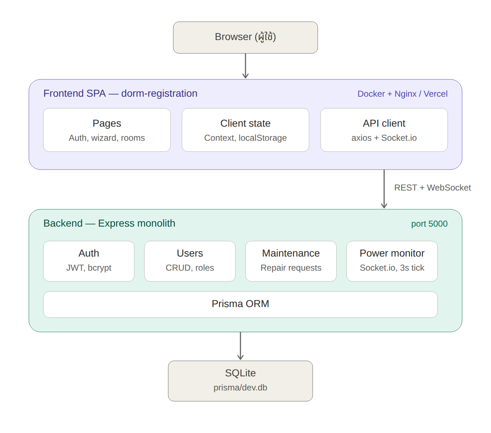
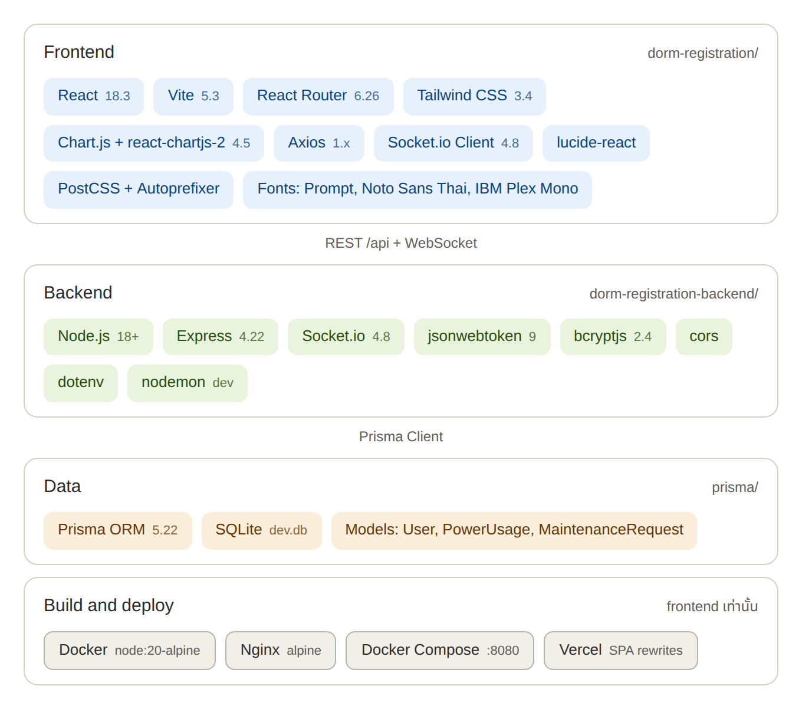

# หอพักเทาทอง — ระบบลงทะเบียนหอพักนิสิต (Web Dorm)

-yellow)


ระบบลงทะเบียนหอพักนิสิตแบบครบวงจร ตั้งแต่สมัครสมาชิก/เข้าสู่ระบบ (OTP) กรอกข้อมูลนิสิต-ผู้ปกครอง เลือกห้องพัก ชำระเงิน ออกใบเสร็จ ไปจนถึงระบบแจ้งซ่อมและมอนิเตอร์การใช้ไฟฟ้าแบบเรียลไทม์

โปรเจกต์นี้เป็น **Monorepo** ประกอบด้วย 2 ส่วนหลัก:

| โฟลเดอร์ | หน้าที่ | เทคโนโลยีหลัก |
| --- | --- | --- |
| [`dorm-registration/`](./dorm-registration) | Frontend (เว็บแอปสำหรับผู้ใช้งาน) | React 18 + Vite + Tailwind CSS |
| [`dorm-registration-backend/`](./dorm-registration-backend) | Backend (REST API + Real-time) | Express.js + Prisma + Socket.io |

---

## สารบัญ

- [ฟีเจอร์หลัก](#ฟีเจอร์หลัก)
- [เทคโนโลยีที่ใช้](#เทคโนโลยีที่ใช้)
- [โครงสร้างโปรเจกต์](#โครงสร้างโปรเจกต์)
- [สถาปัตยกรรมระบบ](#สถาปัตยกรรมระบบ)
- [เริ่มต้นใช้งาน](#เริ่มต้นใช้งาน-getting-started)
- [ตัวแปรสภาพแวดล้อม](#ตัวแปรสภาพแวดล้อม-environment-variables)
- [API Endpoints](#api-endpoints-backend)
- [Docker](#docker)
- [สถานะโปรเจกต์](#สถานะโปรเจกต์)
- [License](#license)

---

## ฟีเจอร์หลัก

- **Authentication** — สมัครสมาชิก / เข้าสู่ระบบ / ยืนยันตัวตนด้วย OTP / เปลี่ยนรหัสผ่าน / จัดการผู้ใช้ (JWT)
- **ลงทะเบียนหอพัก** — กรอกข้อมูลนิสิตและผู้ปกครองแบบเป็นขั้นตอน (Wizard)
- **เลือกห้องพัก** — ผังห้องแสดงสถานะว่าง/ไม่ว่างแบบสี (เขียว/เหลือง/แดง)
- **ชำระเงิน & ใบเสร็จ** — ชำระผ่าน QR/โอนธนาคาร พร้อมออกใบเสร็จจำลอง
- **แจ้งซ่อม (Maintenance)** — แจ้งปัญหาห้องพัก ติดตามสถานะ `PENDING` → `IN_PROGRESS` → `COMPLETED`
- **มอนิเตอร์ไฟฟ้าแบบเรียลไทม์** — ส่งค่าแรงดัน/กระแส/กำลังไฟฟ้าและหน่วยสะสมผ่าน Socket.io
- **แบบประเมิน/รีวิว** — ให้นิสิตรีวิวหลังใช้งานระบบ

---

## เทคโนโลยีที่ใช้

**Frontend**

- React 18 + Vite
- React Router v6
- Tailwind CSS (ธีมกำหนดเอง "เทาทอง" — charcoal + gold)
- Axios, Chart.js / react-chartjs-2
- Socket.io Client

**Backend**

- Express.js + Socket.io (Real-time)
- Prisma ORM (SQLite)
- JWT (`jsonwebtoken`) สำหรับ Authentication
- `bcryptjs` สำหรับเข้ารหัสรหัสผ่าน

---

## โครงสร้างโปรเจกต์

```
web_dorm/
├── dorm-registration/            # Frontend (React + Vite)
│   ├── src/
│   │   ├── components/           # UI Components (OtpInput, StepIndicator, Layout ฯลฯ)
│   │   ├── context/              # AuthContext, RegistrationContext
│   │   ├── data/                 # ข้อมูล mock หอพัก/ชั้น/ห้อง
│   │   └── pages/                # AuthPage, Dashboard, RegisterDorm, RoomSelection, Payment ฯลฯ
│   ├── Dockerfile
│   ├── docker-compose.yml
│   └── vercel.json
│
├── dorm-registration-backend/    # Backend (Express + Prisma)
│   ├── index.js                  # Entry point: routes + Socket.io
│   └── prisma/
│       └── schema.prisma         # Models: User, PowerUsage, MaintenanceRequest
│
├── images/                       # รูปประกอบ README (architecture, tech stack)
└── docker-compose.yml
```

---

## สถาปัตยกรรมระบบ



### Technology Stack



> รายละเอียดโครงสร้าง frontend แบบเจาะลึกดูเพิ่มเติมได้ที่ [`dorm-registration/README.md`](./dorm-registration/README.md)

---

## เริ่มต้นใช้งาน (Getting Started)

### สิ่งที่ต้องมี

- [Node.js](https://nodejs.org) เวอร์ชัน 18 ขึ้นไป
- npm

### 1. Clone โปรเจกต์

```bash
git clone https://github.com/Re-Seth/web_dorm.git
cd web_dorm
```

### 2. ติดตั้งและรัน Backend

```bash
cd dorm-registration-backend
npm install
```

สร้างไฟล์ `.env` (ดู[ตัวแปรสภาพแวดล้อม](#ตัวแปรสภาพแวดล้อม-environment-variables)) แล้วสร้างฐานข้อมูล SQLite ด้วย Prisma:

```bash
npx prisma db push
```

จากนั้นรันเซิร์ฟเวอร์:

```bash
npm run dev      # โหมดพัฒนา (nodemon)
# หรือ
npm start        # โหมด production
```

### 3. ติดตั้งและรัน Frontend

เปิดเทอร์มินัลใหม่:

```bash
cd dorm-registration
npm install
npm run dev
```

จากนั้นเปิดเบราว์เซอร์ที่ URL ที่ Vite แสดง (ค่าเริ่มต้นคือ `http://localhost:5173`)

---

## ตัวแปรสภาพแวดล้อม (Environment Variables)

สร้างไฟล์ `.env` ใน `dorm-registration-backend/`:

| ตัวแปร | ตัวอย่างค่า | คำอธิบาย |
| --- | --- | --- |
| `DATABASE_URL` | `file:./dev.db` | ที่อยู่ไฟล์ฐานข้อมูล SQLite ของ Prisma |
| `JWT_SECRET` | `your_jwt_secret_here` | คีย์ลับสำหรับเซ็น JWT (ควรเปลี่ยนเป็นค่าที่เดายากและห้าม commit) |

---

## API Endpoints (Backend)

| Method | Endpoint | คำอธิบาย |
| --- | --- | --- |
| POST | `/register` | สมัครสมาชิก |
| POST | `/login` | เข้าสู่ระบบ (คืนค่า JWT) |
| POST | `/logout` | ออกจากระบบ *(ต้องมี token)* |
| POST | `/change-password` | เปลี่ยนรหัสผ่าน *(ต้องมี token)* |
| GET | `/me` | ดึงข้อมูลผู้ใช้ปัจจุบัน *(ต้องมี token)* |
| GET | `/check-username/:name` | ตรวจสอบว่า username ซ้ำหรือไม่ |
| GET | `/users` | ดึงรายชื่อผู้ใช้ทั้งหมด *(ต้องมี token)* |
| GET | `/users/:id` | ดึงข้อมูลผู้ใช้รายบุคคล *(ต้องมี token)* |
| PUT | `/users/:id` | แก้ไขข้อมูลผู้ใช้ *(ต้องมี token)* |
| DELETE | `/users/:id` | ลบผู้ใช้ *(ต้องมี token)* |
| GET | `/api/maintenance` | ดึงรายการแจ้งซ่อมทั้งหมด |
| POST | `/api/maintenance` | สร้างรายการแจ้งซ่อมใหม่ |
| PATCH | `/api/maintenance/:id/status` | อัปเดตสถานะการแจ้งซ่อม |

นอกจากนี้ยังมีการส่งข้อมูลการใช้ไฟฟ้า (แรงดัน/กระแส/กำลังไฟฟ้า/หน่วยสะสม) แบบเรียลไทม์ผ่าน **Socket.io**

---

## Docker

ในโฟลเดอร์ `dorm-registration/` มี `Dockerfile` และ `docker-compose.yml` สำหรับ build และรัน frontend ผ่าน Nginx:

```bash
cd dorm-registration
docker compose up --build
```

แอปจะรันที่ `http://localhost:8080`

---

## สถานะโปรเจกต์

โปรเจกต์อยู่ระหว่างการพัฒนา (ความคืบหน้าประมาณ 70%)

---

## License

ยังไม่ได้ระบุสัญญาอนุญาต (License) — โปรดเพิ่มไฟล์ `LICENSE` หากต้องการเผยแพร่แบบโอเพนซอร์ส
